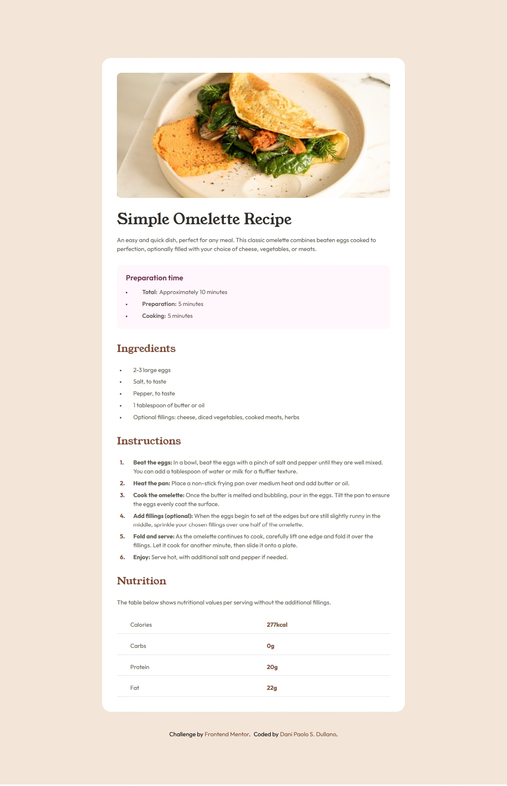

# Frontend Mentor - Recipe page solution

This is a solution to the [Recipe page challenge on Frontend Mentor](https://www.frontendmentor.io/challenges/recipe-page-KiTsR8QQKm). Frontend Mentor challenges help you improve your coding skills by building realistic projects. 

## Table of contents

- [Overview](#overview)
  - [The challenge](#the-challenge)
  - [Screenshot](#screenshot)
  - [Links](#links)
- [My process](#my-process)
  - [Built with](#built-with)
  - [What I learned](#what-i-learned)
  - [Useful resources](#useful-resources)
- [Author](#author)
- [Acknowledgments](#acknowledgments)

## Overview

Based on what i've learned i have implemented the use of css grid and flexbox, using root, variables, fonts and native css nesting.

### The challenge

The trickiest part of this challenge are the different list stye types, and making them responsive on mobile without destroying the text alignment, i had to use pseudo element ::before to make custom bullets and decimals.

### Screenshot

The screenshot was generated with awesome screenshot browser plugin.

### Links

- Solution URL: [https://github.com/mav1283/modern-recipe-card](https://github.com/mav1283/modern-recipe-card)
- Live Site URL: [https://mav1283.github.io/modern-recipe-card/](https://mav1283.github.io/modern-recipe-card/)

## My process

- I started with the HTML5 semantics, getting the exact tags or containers for each part or components
- Adding the main tag for screen readers
- Combine the powers of flexbox and css grid to align and set things according the figma design
- Add external css for the reset, variables and fonts
- Use the figma design as reference by examining each component and knowing their properties.

### Built with

- Semantic HTML5 markup
- CSS custom properties
- Flexbox
- CSS Grid
- Mobile-first workflow
- Pseudo element list style

### What I learned

In this challenge i learned useful tips and tricks to customize the list style bullets an the use of dl, dt and dd tags for specific list that helps screen readers.

### Useful resources

- Eric Meyer's CSS Reset: [cssreset](https://meyerweb.com/eric/tools/css/reset/)
- Awesome screenshot: [awesomescreenshot](https://www.awesomescreenshot.com/)
- W3Schools: [w3schools](https://www.w3schools.com/)
- Convert png to jpg: [png2jpg](https://png2jpg.com/)

## Author

- Frontend Mentor - [@mav1283](https://www.frontendmentor.io/profile/mav1283)
